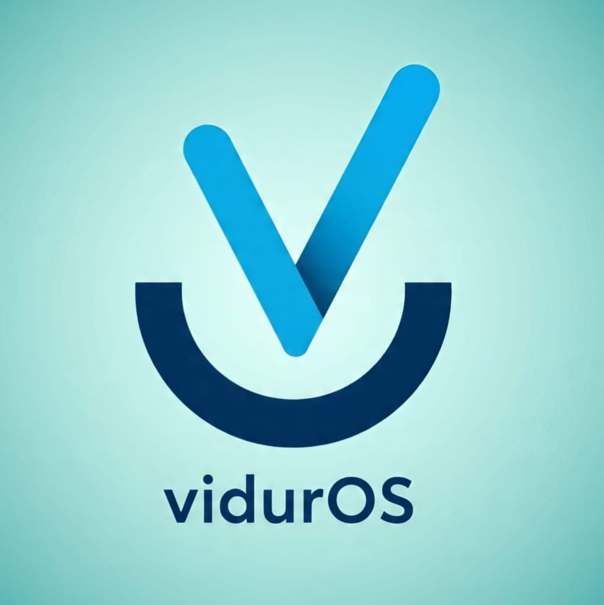
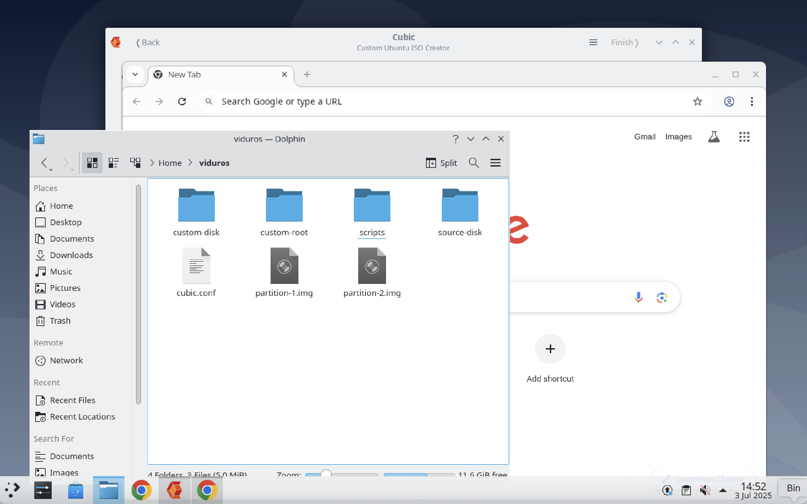
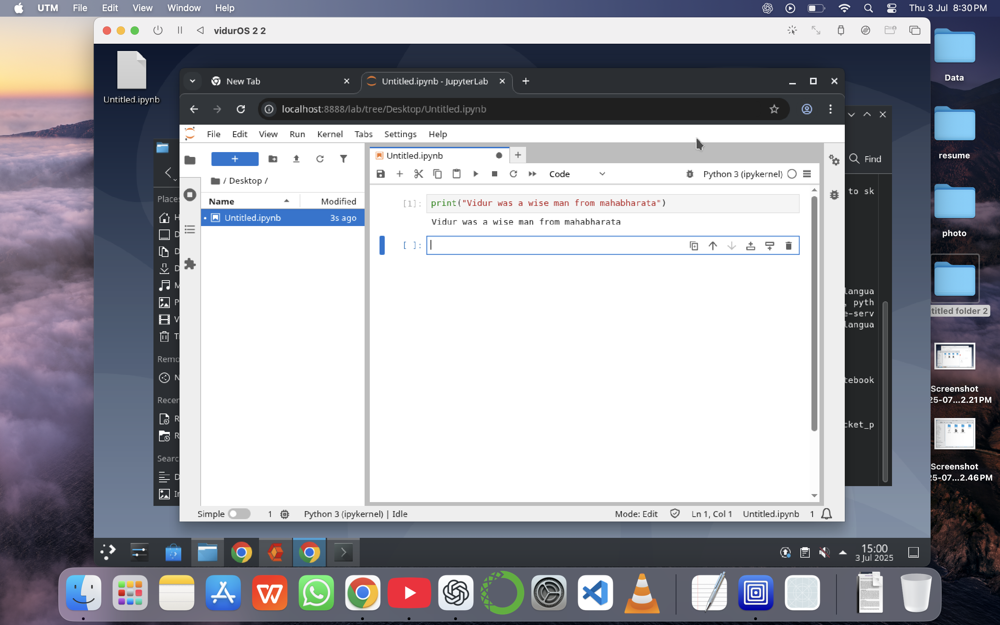
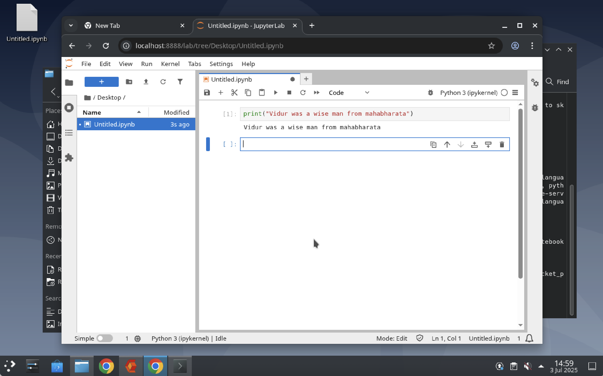
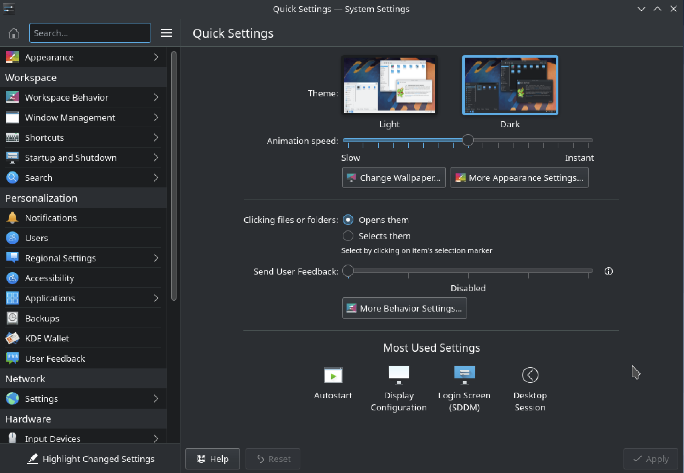
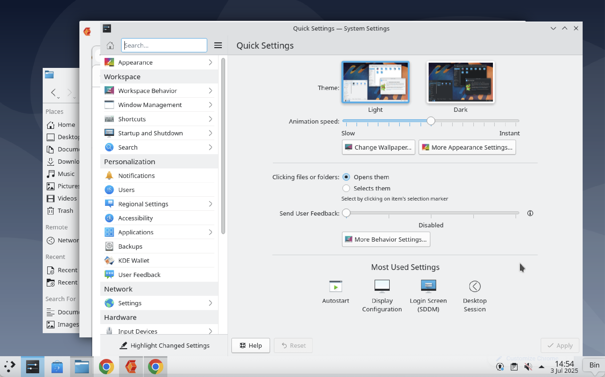
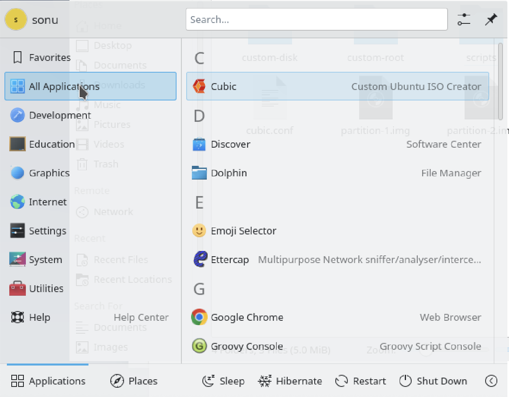
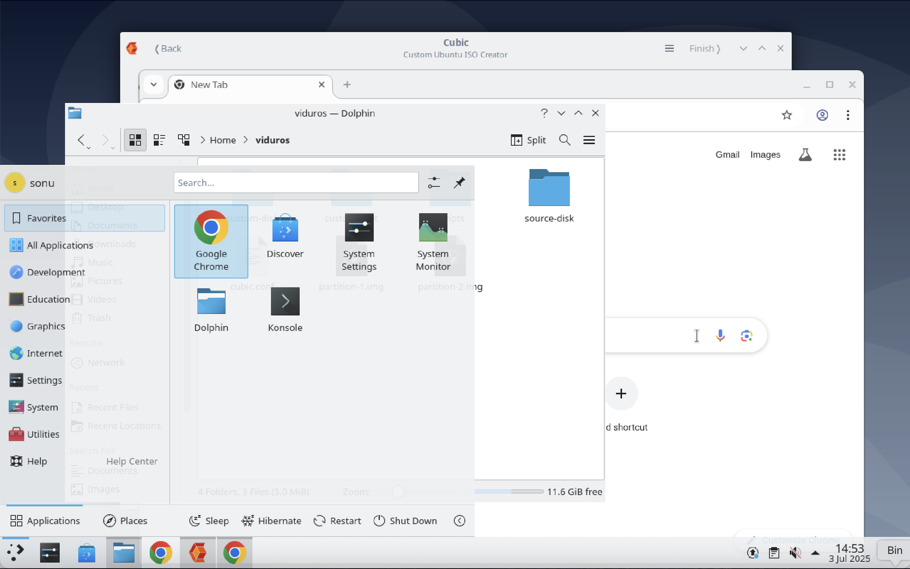
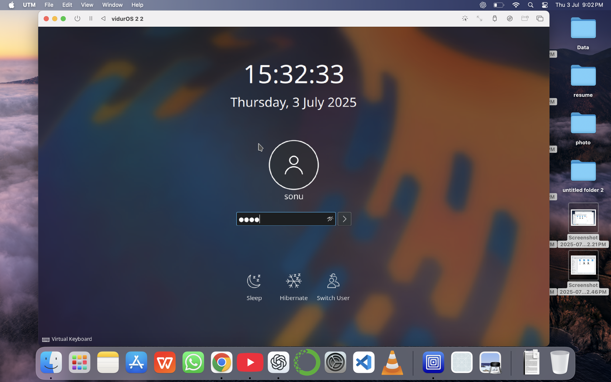

# ⚡ VidurOS

  

> A blazing-fast, lightweight Linux distribution built for **Cybersecurity**, **Programming**, and **AI/ML** – all while reviving older hardware.

---

## 📥 Download

➡️ **[Download Latest ISO](https://github.com/yourusername/viduros/releases/latest)**  
➡️ Or browse all [Releases](https://github.com/yourusername/viduros/releases)

> ✅ Lightweight ISO | ~1.7 GB  
> ✅ Works on x86_64 CPUs

---

## ✨ Features

- 💻 **XFCE Desktop** — sleek, fast, customizable UI
- 🧠 Preloaded with **AI/ML libraries** (TensorFlow, PyTorch optional)
- 🛡️ Cybersecurity tools (Nmap, Wireshark, Metasploit, etc.)
- 💡 Programming essentials (Python, Node.js, C/C++, Rust)
- 🪶 Lightweight – perfect for old laptops and VMs
- 🌐 Live ISO — run without installation
- 📦 APT + Flatpak support
- 🔧 Built from `ubuntu-22.04.5-live-server-amd64.iso` using **Cubic**

---

## 🖼️ Screenshots

 
  
   
    
     
      
       
        
 

---

## 💽 Installation

### 🖥️ Run Live

1. Download ISO from [Releases](https://github.com/yourusername/viduros/releases)
2. Flash to USB using [Balena Etcher](https://etcher.io/) or [Rufus](https://rufus.ie/)
3. Boot your PC or VM from USB
4. Select **Try without installing**

